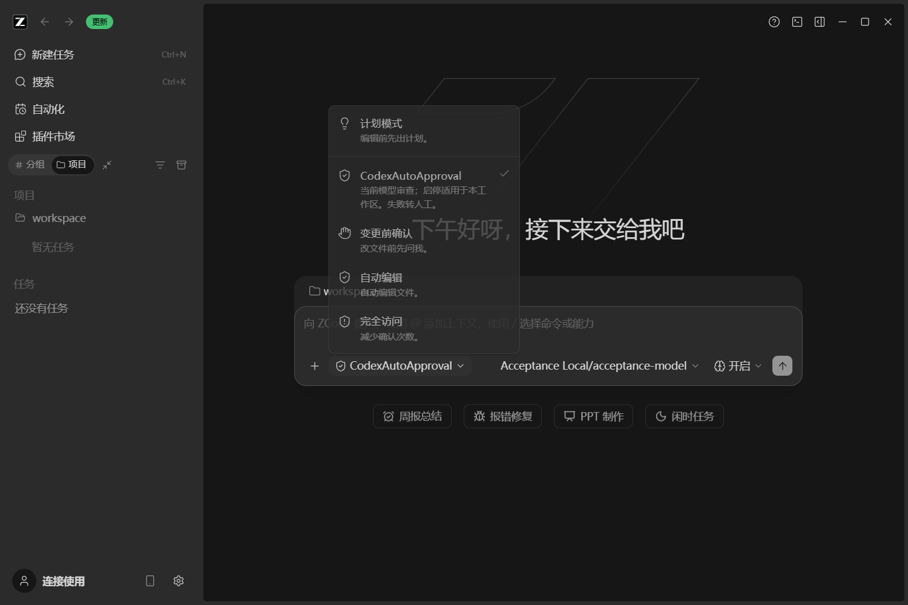
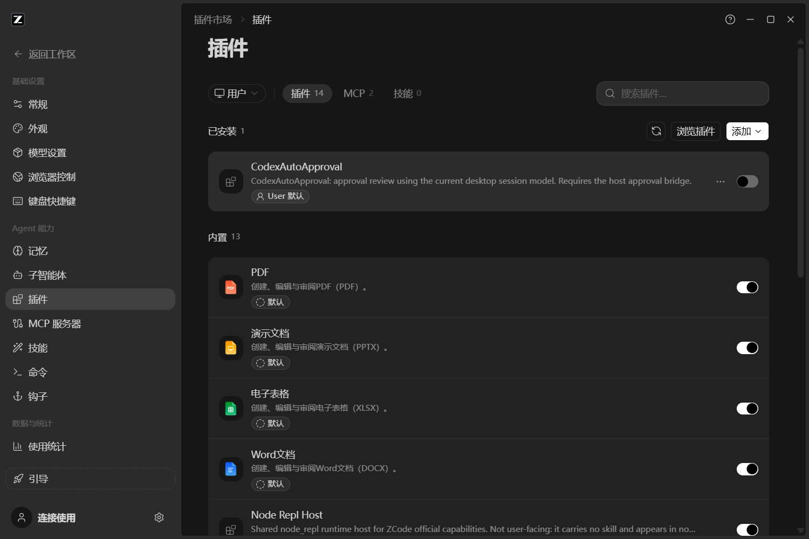

# CodexAutoApproval for ZCode

让 ZCode 桌面在执行需要审批的动作前，用**跟随会话或单独指定的模型**做一次风险审查。风险策略来自固定版本的 OpenAI Codex；通过 ZCode 的原生审批流程放行、拒绝或转人工。

权限菜单中的独立选项和插件列表均叫 **CodexAutoApproval**，选项下的小字为“由Codex迁移的自动审批”。「自动编辑」仍是 ZCode 原生功能。

**适配桌面发行：0.2.0；插件：0.1.3；上游源码基线：3.14.3。Windows x64 本地桌面会话，第三方适配项目。** 完整功能需要本项目配套的适配桌面；只在官方桌面安装插件，会因缺少审批桥而回到人工审批。这里移植的是审批核心，不是 Codex 全量复现，也不是 OpenAI 或 ZCode 官方发行。

[0.2.0 安装升级验收](docs/autoreview-0.2.0-acceptance.md) · [稳定升级说明](docs/distribution-upgrades.md) · [Responses 源码续接修复](docs/responses-continuation-2026-10-02.md) · [功能对照](docs/migration.md) · [源码构建](host-adapter/README.md)。此前便携版验收见 [0.1.3](docs/desktop-acceptance.md)、[0.1.2](docs/desktop-acceptance-0.1.2.md)。

0.1.3 增加独立审查模型配置，复用宿主供应商、原生协议适配器及密钥管理。指定后只调用所选模型，技术失败转人工。进度和完成记录显示实际审查模型。真实 DeepSeek 放行、拒绝和文件调查续接已通过；GLM 两条路径因原生账号凭据未解析成功停在准备阶段，本轮未验证原拦截是否解除。详见[验收报告](docs/desktop-acceptance.md)。

## 安装

**环境要求：Windows x64、Node.js 22 或以上，且 `node` 已加入系统 `PATH`。** 插件使用系统 Node；在 PowerShell 中运行 `node --version` 确认版本为 v22 或以上。安装 Node 后退出并重新启动 ZCode，让桌面读取更新后的环境变量。

### 1. 下载并启动适配桌面

从 [0.2.0 Release](https://github.com/MagicSpirit007/CodexAutoApprovalZcode/releases/tag/autoreview-v0.2.0) 下载独立 NSIS 安装器 `ZCodeAutoReview-0.2.0-win-x64.exe`，默认安装到 `D:\CodexAutoReview\zcode\runtime\ZCodeAutoReview`。始终使用 **ZCode AutoReview** 快捷方式；后续启动检查本项目正式适配版，下载与重启安装分别手动确认。首次安装后可用迁移脚本重定向旧适配快捷方式，沿用历史会话、已安装插件和审查模型设置。发布、校验与回退流程见[独立安装及稳定升级说明](docs/distribution-upgrades.md)。

下面的 0.1.3 便携目录保留为历史回退材料；该入口不会自行迁移到新安装方式。

旧便携版为本地 `artifacts/0.1.3/CodexAutoApproval-Windows-0.1.3.zip`，原入口为 `artifacts/0.1.3/CodexAutoApproval-Windows/ZCode.exe`，保留作回退材料。本机迁移后，原快捷方式已指向固定安装目录中的 **ZCodeAutoReview.exe**。

适配桌面使用独立应用身份 `ZCode AutoReview`，可以与原版并存。已有旧适配版运行时，先退出旧版再启动新版；无需 `.cmd` 启动包装。按 ZCode 正常流程配置模型，并打开本地工作区。

### 2. 安装插件 ZIP

已经安装并启用 0.1.3 插件的适配桌面可继续沿用，无需重装。首次安装时使用本地 `artifacts/0.1.3/CodexAutoApproval-plugin-0.1.3.zip`，解压到任意目录。

在桌面 **设置 → 插件 → 创建 → 添加 marketplace** 中，选择**包含 marketplace.json 的解压目录**，然后安装并启用 **CodexAutoApproval**。不要直接选择 ZIP 文件，也不要选择其内部的插件子目录。

插件包提供相对路径 marketplace、审批代码和策略，使用系统 Node.js；安装后不依赖解压目录或源码。[ZCode 官方安装规范](https://zcode.z.ai/en/docs/plugin)支持本地 marketplace。

插件技术安装 ID 为 `codex-auto-approval@codex-auto-review-local`；保留它是为了兼容已有安装，显示名称为 CodexAutoApproval。

**0.1.3 请使用上述本地安装方式。** 本地插件 ZIP 已移除随包 Node，满足宿主归档安装器的单文件 50 MiB 限制；当前交付方式为本地 marketplace，仓库地址安装尚未复验。

### 3. 新建会话并选择权限选项

**安装或重新启用后新建会话**，在输入框旁的权限菜单选择 **CodexAutoApproval**。该选项会启用当前工作区的插件，并进入正常审批流程；`Ctrl+Shift+M` 可在可用权限选项间切换。





工作区有任务运行时，权限切换会锁住。已有会话停用后重新启用，需要新建会话，菜单会提示原因；ZCode 的 PermissionRequest Hook 在创建会话时加载。

### 4. 配置审查模型

在 **设置 → 插件 → CodexAutoApproval → 高级信息 → 审查模型** 中选择“跟随会话”，或从原生模型菜单指定供应商、模型与支持的推理档位，点击保存。旧配置默认跟随会话。用户作用域保存默认选择，工作区作用域可覆盖；“恢复继承值”会删除工作区覆盖。保存后下一次审查生效，在途配置变化会使旧结果失效。

通过模型菜单的 **管理模型** 进入原生供应商配置，填写自定义 Base URL、协议和 API Key。插件只保存模型引用与推理选项。审查模型切换不会改变主会话模型；模型删除、缺少凭据或能力不兼容会显示原因并转人工。

**GLM 出现 `request has been blocked due to unusual activity.` 时：** 这表示供应商拦截了审查请求，审批尚未得到结论。2026-10-02 的现场日志确认，同一会话的普通 GLM 请求成功，自动审查请求收到状态码 405 并立即转人工；0.1.3 并未验证解除该拦截。旧配置仍默认跟随会话，独立审查模型需在上述设置中主动指定。可先人工处理当前动作，或配置独立审查模型；具体阻断规则仍需供应商确认。详见[本次排查与修复范围](docs/glm-review-block-2026-10-02.md)。

**Responses 出现 `No tool call found for tool output with call_id` 时：** 这是工具结果续接失败，与上述 GLM 拦截分开处理。此前 0.1.3 的真实 DeepSeek 调查验收使用 Chat Completions，不能证明 Responses 续接可用。2026-10-02 的修复使自动审查发送完整工具历史，当前 `deepseek-v4-flash` Responses 已完成两个真实调查续接样例。宿主补丁与本地最终包已包含修复。本机日常入口已替换为最终包，自动审查按使用者选择改为独立 Chat Completions 供应商，仍使用 `deepseek-v4-flash` / `max`。包内 Agent、真实插件子进程与桌面审批链完成了调查、工具结果续接和一次获准执行；复杂验收留给使用者。详见[源码续接报告](docs/responses-continuation-2026-10-02.md)和[本次构建记录](docs/desktop-build-responses-2026-10-02.md)。

### 校验下载

本地产物目录 `artifacts/0.1.3/` 提供 `SHA256SUMS.txt`，可用 PowerShell 校验文件：

```powershell
Get-FileHash .\CodexAutoApproval-Windows-0.1.3.zip -Algorithm SHA256
Get-FileHash .\CodexAutoApproval-plugin-0.1.3.zip -Algorithm SHA256
```

## 选项与审批行为

| 权限选项 | 所属功能 | 在适配桌面中的效果 |
| --- | --- | --- |
| 变更前确认 | ZCode 原生 | 在当前工作区停用本插件，使用原生 build 权限流程 |
| 自动编辑 | ZCode 原生 | 在当前工作区停用本插件，使用原生 edit 权限流程 |
| 完全访问 | ZCode 原生 | 在当前工作区停用本插件，使用原生 yolo 权限流程 |
| **CodexAutoApproval** | 本项目 | 启用当前工作区插件，审查原生流程实际要求审批的动作 |
| 计划模式 | ZCode 原生独立约束 | 保留 Plan 限制，不因自动审批而解除 |

启停作用于整个工作区。明确禁止规则、Plan 限制和工具参数校验仍由宿主执行；插件只接入实际到达 `PermissionRequest` 的动作，不添加永久许可规则。

| 审查结果 | 后续行为 |
| --- | --- |
| `allow` | 只放行本次绑定的动作；不缓存许可，不添加永久权限规则 |
| `deny` | 不执行；把具体理由与禁止绕过指引反馈给主模型，可继续独立的已授权工作 |
| 认证、网络、无效输出、预算不足、桥故障或超时 | 登记人工应答后显示确认窗口及脱敏失败原因；不会默认放行，也不计为策略拒绝 |
| 用户取消 | 终止在途请求，不执行动作 |
| 连续 3 次拒绝，或最近 50 次审查中累计 10 次拒绝 | 按宿主轮次熔断，停止当前轮，保留会话 |

默认总审查时限 **90 秒**，最多 **3 次尝试**。审批模型默认继承桌面当前会话，也可单独指定供应商、模型及推理档位；凭据留在宿主，由原生 Chat Completions、Responses 或 Anthropic 适配器调用。指定模型技术失败时不会更换供应商。它只可读取工作区文件、调查目录，不能执行 shell、写文件或使用网络工具。审查请求包含真实用户授权、近期工具证据及拒绝记录，排除主模型隐藏推理。

已加载且启用本插件的审查能力时，工具行显示“正在自动审查”；完成记录保留实际审查模型与结果；技术失败才显示人工窗口。未加载或已停用时使用原生审批流程。

每次审查绑定会话、轮次、工具调用、完整参数指纹、主会话模型、实际审查模型、配置版本和授权快照。模型、配置或授权发生变化时，旧结果失效并重新审查。

## 停用与卸载

在权限菜单选择任一原生权限选项，会停用当前工作区插件；也可在插件设置中停用或卸载 **CodexAutoApproval**。随后新建会话，使用宿主原生权限流程。

如果看不到 CodexAutoApproval 权限选项，先确认运行的是 Release 中的适配桌面，再检查插件是否安装并启用。插件在官方原版桌面中的技术故障回退为人工审批，无法仅靠 marketplace 给原版增加模型桥和菜单。

## 与 Codex 的关系及验证范围

| 项目 | 固定基线 / 状态 |
| --- | --- |
| Codex 审批策略来源 | [`d42056091aded7feb1d88ac7e83972108b2aa478`](https://github.com/openai/codex/tree/d42056091aded7feb1d88ac7e83972108b2aa478) |
| ZCode 宿主源码 | [`29628c9acdb81b703bbd4080c207a0e7ce5e276e`](https://github.com/zai-org/ZCode/tree/29628c9acdb81b703bbd4080c207a0e7ce5e276e)，版本 3.14.3 |
| Windows 发行外壳 | 已安装 ZCode 3.14.4 的 Electron 与原生资源，替换为固定源码重建的桌面 JavaScript 和 Agent |
| 本次回归与真实模型结果 | 见[0.1.3 验收报告](docs/desktop-acceptance.md)，按实际执行结果分别记录 |

这个 Windows 包是**混合版本的适配发行**，不是官方 3.14.4 源码的完整重建。桌面包内 `AUTO-REVIEW-BUILD.json` 记录来源和原始 / 适配产物指纹。官方更新机制保留；官方更新可能替换适配代码，升级后需要重新核对菜单和审批桥。

本机 HTTP 模型用于界面和故障回归，真实 DeepSeek 与 GLM 另行验收，不能互相替代。DeepSeek 自动审批成功不能证明 GLM 原通道解除拦截。目前交付 Windows x64 本地桌面；SSH、WSL、远程工作区和其他桌面系统未验证。模型审批不提供 OS 隔离。

[迁移对照](docs/migration.md)逐项标注「与 Codex 一致 / 宿主适配 / 未支持 / 未实测」并给出源码位置。[验收记录](docs/desktop-acceptance.md)包含测试说明、已知 lint 基线问题和实测证据。

## 开发与目录

```text
marketplace.json             本地安装入口（与插件 ZIP 一同提供）
plugins/codex-auto-approval/  Windows 插件、Hook 和策略；使用系统 Node.js
src/                        可复用审批核心与桌面客户端
prompts/                    默认风险策略与评估模板
host-adapter/               固定 ZCode 提交的完整源码补丁与构建说明
test/                      CLI、真实 Hook 子进程、宿主链路测试
docs/                      功能对照、验收记录、截图与独立 CLI 用法
scripts/                    打包、构建分发及验证工具
```

基础测试需要 Node.js 22+，不需要 npm 依赖安装，也不访问真实模型：

```sh
git clone https://github.com/MagicSpirit007/CodexAutoApprovalZcode.git
cd CodexAutoApprovalZcode
npm test
npm run check
```

宿主链路测试和桌面重建需要检出、应用补丁并安装固定 ZCode 源码依赖，详见 [host-adapter/README.md](host-adapter/README.md)。仓库还保留兼容的独立 CLI，用法见 [docs/cli.md](docs/cli.md)；它使用自己的模型配置，不读取 Codex 登录信息。

贡献前请阅读 [CONTRIBUTING.md](CONTRIBUTING.md)，安全问题处理见 [SECURITY.md](SECURITY.md)。

## 许可证与致谢

本项目源码按 [Apache-2.0](LICENSE) 发布，保留 [NOTICE](NOTICE) 中的 OpenAI Codex 与 ZCode 来源说明。Windows 桌面包中的 Electron、Chromium、Node 和其他第三方组件保留各自许可证。

感谢 [OpenAI Codex](https://github.com/openai/codex)、[ZCode](https://github.com/zai-org/ZCode) 及其贡献者。
